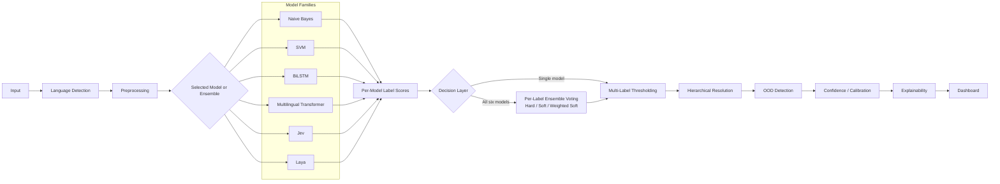

# Architecture

NALTRA uses one prediction contract for all model families. Model-specific code produces label scores; a decision layer either keeps one model's prediction or combines all six predictions per label. Shared pipeline stages then resolve thresholds, hierarchy, OOD, calibration metadata, explanations, and presentation.

## Boundaries

- `models/` owns training, persistence, and raw scores behind `BaseNALTRAModel`.
- `pipeline/` owns shared language, preprocessing, ensemble voting, threshold, hierarchy, and OOD flow.
- `schemas/` is the stable boundary consumed by evaluation and the dashboard.
- `evaluation/` reads predictions without depending on model internals.
- `dashboard/` consumes prediction results and must not contain training logic.

The initial scaffold deliberately avoids dependency injection frameworks, service layers, and deployment infrastructure. Add abstractions only when two or more implementations need them.

For ensemble mode, all configured model families return a `PredictionResult`.
Soft voting uses complete `label_scores`; legacy results fall back to selected
label scores and treat omissions as zero. Hard voting uses selected `labels` and
treats omissions as negative votes. Declared dataset, track, and label spaces must
match across components. The ensemble follows shared hierarchy and OOD stages.

The neural models and shared pipeline are implemented. Jev/Laya remain disabled
until real provider contracts are configured. See [core ML operation](core_ml.md)
for artifacts, training commands, OOD semantics, extension hooks and integrations.
