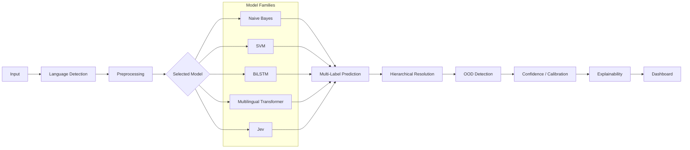

# Architecture

NALTRA uses one prediction contract for all model families. Model-specific code produces label scores; shared pipeline stages then resolve hierarchy, OOD, calibration metadata, explanations, and presentation.

## Boundaries

- `models/` owns training, persistence, and raw scores behind `BaseNALTRAModel`.
- `pipeline/` owns shared language, preprocessing, threshold, hierarchy, and OOD flow.
- `schemas/` is the stable boundary consumed by evaluation and the dashboard.
- `evaluation/` reads predictions without depending on model internals.
- `dashboard/` consumes prediction results and must not contain training logic.

The initial scaffold deliberately avoids dependency injection frameworks, service layers, and deployment infrastructure. Add abstractions only when two or more implementations need them.
