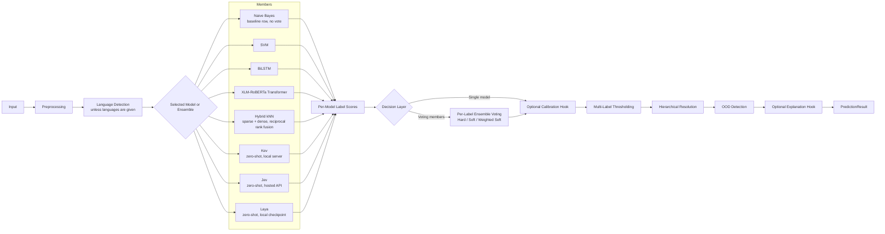

# Architecture

NALTRA uses one prediction contract for all members. `PredictionPipeline` preprocesses the text first, then detects its language on the preprocessed text unless the caller supplies languages (`src/naltra/pipeline/prediction.py`). Model-specific code produces label scores; a decision layer either keeps one member's prediction or combines the voting members per label. Shared pipeline stages then apply an optional calibrator, resolve thresholds, hierarchy and OOD, and call an optional explainer; the calibration and explanation hooks are extension points that only the tests use. The reported benchmark votes offline over saved score matrices (`scripts/evaluate_ensemble.py`, see the [runbook](runbook.md)).

## Boundaries

- `models/` owns training, persistence, and raw scores behind `BaseNALTRAModel`.
- `pipeline/` owns shared language, preprocessing, ensemble voting, threshold, hierarchy, and OOD flow.
- `schemas/` is the stable boundary consumed by evaluation and the results page.
- `evaluation/` reads predictions without depending on model internals.
- `scripts/build_dashboard.py` builds the results page (`docs/results/index.html`) from saved summaries and score matrices; it contains no model or training logic.

The initial scaffold deliberately avoids dependency injection frameworks, service layers, and deployment infrastructure. Add abstractions only when two or more implementations need them.

For ensemble mode, all configured members return a `PredictionResult`.
Soft voting uses complete `label_scores`; legacy results fall back to selected
label scores and treat omissions as zero. Hard voting uses selected `labels` and
treats omissions as negative votes. Declared dataset, track, and label spaces must
match across components. The ensemble follows shared hierarchy and OOD stages.

All members and the shared pipeline are implemented. Kev answers through a local
server and Jev through TypeSafe's hosted API, with the same questions; Laya runs a
pinned multilingual checkpoint locally, one two-option question per label. See
[core ML operation](core_ml.md) for artifacts, training commands, OOD semantics,
extension hooks and integrations. The near-OOD benchmark (humanities root held out of
training) is `scripts/run_ood.py`.

## CORDIS training boundary

The active dataset is CORDIS H2020. Stored records preserve `labels_direct` and ancestor-closed `labels`. All CORDIS training uses direct targets explicitly; direct probabilities and selections remain in `PredictionResult.label_scores` and `PredictionResult.labels`, while ancestors appear in `hierarchy_paths`. Full-label calibration and ordinary classification must use the same direct label universe. Dataset integrity checks are shared by the validator and the training CLI.
